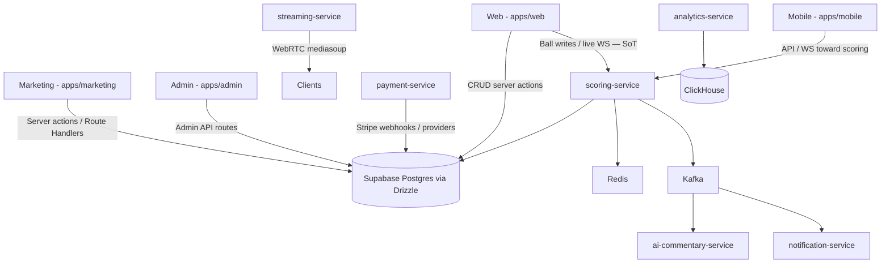

# Shakir Super League (SSL) — Product & Feature Guide
**Pakistan’s Cricket Tournament & League Management Platform**  
*Built by Malik Tech (MTK) • Lead Developer: Muhammad Kashif*

> **Doc truth (2026-09-23):** This guide describes the **current architecture**, not the aspirational all-traffic-via-gateway model. Canonical backend decision: [`architecture/BACKEND_UNIFICATION_DECISION.md`](./architecture/BACKEND_UNIFICATION_DECISION.md) (**Accepted**).

**Repository:** https://github.com/Kaashmalik/mtk-ssl2026.git  
**Deploy status:** Not publicly deployed. Intended domain: `ssl.mtkcodex.site` (see repo root `live.md`).

---

## Table of Contents
1. [Platform Architecture & Applications](#1-platform-architecture--applications)
2. [User Roles & Management](#2-user-roles--management)
3. [Leagues & Tenant Management](#3-leagues--tenant-management)
4. [Tournament Formats & Match Auto-Scheduling](#4-tournament-formats--match-auto-scheduling)
5. [Live Ball-by-Ball Scoring System](#5-live-ball-by-ball-scoring-system)
6. [Interactive Match Analytics](#6-interactive-match-analytics)
7. [Scorecards & Career Statistics](#7-scorecards--career-statistics)
8. [Feature maturity](#8-feature-maturity)
9. [Known security follow-ups](#9-known-security-follow-ups)
10. [Setup & Local Development Workflows](#10-setup--local-development-workflows)

---

## 1. Platform Architecture & Applications

SSL is a Turborepo monorepo: Next.js apps for product UI/CRUD, plus NestJS **specialist** services for real-time and side planes.



| Plane | Responsibility |
|-------|----------------|
| **Next.js + Drizzle** | Tenants, tournaments, teams, players, matches metadata, registrations, subscriptions (manual queue), admin CRUD |
| **scoring-service** | **Canonical ball-by-ball source of truth** (HTTP/WS + Kafka + Redis). Migration `023` (`ball_sequence` / offline sync). Web `actions/scoring` must become a thin proxy — no new dual-write ball logic |
| **streaming-service** | WebRTC (beta) |
| **ai-commentary-service** | GPT commentary from scoring events (beta) |
| **payment-service** | Stripe + JazzCash/EasyPaisa online providers (scaffold). Product PK path ships **manual proof now**; online checkout is the planned upgrade |
| **analytics-service** | ClickHouse analytics |
| **notification-service** | Push / email / SMS fan-out |
| **api** | Tenants helpers + SSL/ACME white-label automation |
| **api-gateway / auth-service / tournament-service** | Present under hybrid; CRUD for tournaments remains primarily in Next.js until explicitly migrated |

### Frontend Applications

*   **Marketing (`apps/marketing`)**: Landing, pricing, waitlist.
*   **Web (`apps/web`)**: League portal — captains, players, scoring UI, settings.
*   **Admin (`apps/admin`)**: Super-admin dashboard — tenants, revenue approval, impersonation, announcements.
*   **Mobile (`apps/mobile`)**: Expo — fans/scorers; offline queue hooks exist (must sync to scoring-service, not bare anon PostgREST).

---

## 2. User Roles & Management

Authentication is **Clerk** (apps). App permissions use server-side guards (`withAuth`, role checks, admin `verifySuperAdmin`). Casbin exists inside `services/auth-service` for gRPC paths — it is **not** the primary web RBAC.

| Role | Platform | Scope |
| :--- | :--- | :--- |
| **Super Admin** | Admin | Cross-tenant, revenue, feature flags, impersonation |
| **League Admin** | Web / Admin | Tenant branding, approvals, fees, scorers |
| **Team Captain** | Web / Mobile | Team registration, squad, fees |
| **Scorer** | Web / Mobile | Ball-by-ball for assigned matches |
| **Player / Fan** | Web / Mobile | Read-mostly |

---

## 3. Leagues & Tenant Management

SSL is multi-tenant: tenant-scoped rows use `tenant_id` (and related junction tables such as `user_tenant_roles`).

### Isolation model (important)

> **App-layer tenant scoping is the real control plane** for web, admin, and Nest Drizzle paths. Those clients use `DATABASE_URL` / service-equivalent Postgres access and **do not enforce Supabase RLS**.
>
> RLS policies in `supabase/migrations` matter for **PostgREST** (`anon` / `authenticated`) — e.g. marketing waitlist, some mobile Supabase client calls. Treat RLS as defense-in-depth for that surface, not as what protects Next.js/Nest CRUD today.

### Tenant creation & domains
1. League setup creates a `tenants` row (and branding).
2. **Intended** host pattern after go-live: `[slug].ssl.mtkcodex.site` (or path-based until wildcard DNS is live). Brand aspirational domain `ssl.cricket` is not live.
3. White-label (Enterprise): custom domain, theme tokens, hide SSL footer — partial implementation (see white-label docs).

---

## 4. Tournament Formats & Match Auto-Scheduling

Formats supported in product schemas/UI: knockout, league, hybrid, round_robin.

> Auto-scheduling / full bracket engine and automatic NRR are **roadmap** — do not treat as shipped platform automation. DLS calculator UI/lib exists on web.

---

## 5. Live Ball-by-Ball Scoring System

**Source of truth:** NestJS **`services/scoring-service`** (settled decision; migration `023` staging-verified for `ball_sequence` / offline sync).

Web scoring UI should call scoring-service (directly or via a thin server-action proxy). Do not grow a second persistence path in `apps/web/src/app/actions/scoring.ts`.

### Scoring actions
*   Standard deliveries, extras (wide / no-ball / bye / leg-bye), wickets, striker swap rules.
*   Offline: queue client-side, then sync to scoring-service with idempotent `client_op_id` / sequence (see migration `023`). Mobile must not rely on unauthenticated anon inserts against `match_balls` RLS.

---

## 6. Interactive Match Analytics

Wagon Wheel, Manhattan, and Worm chart components exist on the web scoring experience. They consume match state from the scoring client/store — keep them wired to scoring-service SoT as the proxy migration lands.

---

## 7. Scorecards & Career Statistics

Scorecard tables: `batting_scorecards`, `bowling_scorecards`, `fielding_scorecards`.  
Career aggregate: materialized view `player_all_time_stats` (migration `017`), refreshed from `player_season_stats`.

---

## 8. Feature maturity

| Feature | Status |
|---------|--------|
| Fantasy cricket | **Pre-MVP / roadmap** — DB schema only; no product UI. Do not list as shipped. |
| AI commentary | **Beta** — service exists; market as early-access, not GA. |
| WebRTC streaming | **Beta** — mediasoup service; early-access, not GA. |
| Pakistan payments | **Both manual and online are in scope.** **Now:** manual JazzCash / EasyPaisa / bank + Supabase Storage proof upload (admin approval queue). **Future update:** turn on merchant online APIs so users pay without uploading receipts — easier for everyone. JazzCash provider class is ready to wire; EasyPaisa online remains stub until credentials/API work lands. |
| Media | **Cloudinary** for admin image uploads; **Supabase Storage** for payment proofs only. |

---

## 9. Known security follow-ups

1. **Phase 2 — live grant check:** Run `has_table_privilege()` (or Supabase advisors) on the real project for roles `anon` / `authenticated` on `user_tenant_roles` and `impersonation_sessions`. Code today is Drizzle-only for those tables; if any privilege exists, `REVOKE` all from `anon`/`authenticated` and add RLS when/if PostgREST access is required.
2. Harden mobile offline sync to authenticated scoring-service APIs (anon `match_balls` inserts are denied by RLS and use incorrect column shapes).
3. Continue treating service-role / `DATABASE_URL` paths as requiring strict app-layer authorization reviews.

---

## 10. Setup & Local Development Workflows

```bash
pnpm install
pnpm run build
# Apply migrations via your usual Supabase / packages/database flow
pnpm run dev
```

### Port mapping (typical)
*   Marketing: `http://localhost:3000`
*   Web: `http://localhost:3001`
*   Admin: `http://localhost:3002`
*   Scoring service: `http://localhost:4002` (see service `env.ts`)
*   Expo Metro: `http://localhost:8081`
